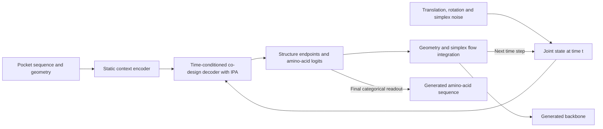

# ApexGen Joint-v2: Sequence-Structure Co-Design

ApexGen Joint-v2 is a **sequence-structure co-design model based on flow matching,
conditioned on pocket sequence and geometry**. It jointly generates the amino-acid
sequence and backbone structure of a target peptide while keeping the conditioning
pocket fixed.

The model brings **continuous structural variables and discrete amino-acid identities
into a unified continuous flow-matching framework**. Backbone geometry is represented
by residue translations and rotations. Discrete sequence identities are represented
during the flow by continuous probability vectors on the amino-acid simplex, then
decoded into amino-acid categories at the end of generation.

## Joint continuous state

For a target of length $L$, the joint state at flow time $t$ is

$$
z_t = \{(x_i(t), R_i(t), p_i(t))\}_{i=1}^{L},
\qquad x_i(t) \in \mathbb{R}^{3},\quad
R_i(t) \in \mathrm{SO}(3),\quad p_i(t) \in \Delta^{19},
$$

where $\Delta^{19}$ is the probability simplex over the 20 amino-acid types.
The conditioning input is $c=(s_{\mathrm{pocket}},g_{\mathrm{pocket}})$: pocket
residue identities and observed geometry, together with the masks and site information
needed to define the target region. The current sampler uses a specified target length.

| State component | Continuous representation | Initial distribution | Generated output |
|---|---|---|---|
| Backbone position | Translation in $\mathbb{R}^{3}$ per residue | Gaussian noise | Residue positions |
| Backbone orientation | Rotation in $\mathrm{SO}(3)$ per residue | Haar-distributed rotations | Residue frames and N/CA/C backbone atoms |
| Amino-acid identity | Probability vector in $\Delta^{19}$ per residue | Symmetric Dirichlet noise | Discrete amino-acid sequence from final categorical logits |

All three components share the normalized flow time $t\in[0,1]$ and a coupled neural
decoder. The sequence flow evolves continuous simplex states; amino-acid labels remain
categorical supervision and final outputs. This lets sequence and structure interact
throughout generation while using geometry-appropriate and simplex-appropriate updates.

## Model architecture

1. **Pocket conditioning.** A static context encoder builds residue and pair features
   from the pocket sequence and geometry. Its encoding is reused throughout sampling.
2. **Joint decoding.** A time-conditioned decoder combines the pocket encoding with
   the current noisy geometry and sequence simplex. Invariant point attention (IPA),
   rigid-frame refinement, and sequence feature updates couple the two design tasks.
3. **Flow integration and readout.** The network predicts structural endpoints and
   amino-acid logits. These predictions parameterize the geometry and sequence flow
   updates. Integration produces the backbone, and a final categorical readout produces
   the amino-acid sequence.



Training uses a joint objective consisting of translation endpoint error, rotation
tangent error, and native amino-acid cross-entropy. The sequence path is Dirichlet,
with $\alpha(t)=1+7t$ in the current configuration. At sampling time, the predicted
categorical probabilities define a continuous simplex flow. Finite terminal Dirichlet
concentration does not make the simplex state exactly one-hot; the final logits supply
the discrete sequence readout.

The repository includes data conversion, portable training, multi-GPU training,
rollout evaluation, and generation. The bundled BoltzGen examples support exploratory
training and overfitting tests.

## Installation

```bash
git clone --branch sequence-structure-co-design https://github.com/XiaoqiongXia/apexgen-joint-v2.git
cd apexgen-joint-v2
source scripts/project_tmp_env.sh
python3.12 -m venv .venv
source .venv/bin/activate
python -m pip install --upgrade pip
python -m pip install -c requirements/portable-tested-py312.txt -e '.[dev]'
apexgen-simplex --help
```

Dependency ranges are defined in `pyproject.toml`. The constraints file pins the direct
dependencies used in the CPython 3.12 validation, including PyTorch 2.10.0; it is not a
complete transitive dependency lock. Before using a GPU, check:

```bash
python -c 'import torch; print(torch.__version__, torch.cuda.is_available())'
```

The CLI defaults to CPU. In a CUDA-enabled environment, replace `--device cpu` with
`--device cuda:0`. This runner uses one process and one device; it does not support
launching distributed training directly with torchrun.

Run `source scripts/project_tmp_env.sh` in each new shell to keep caches and temporary
files inside the project.

## Run the example

`examples/boltzgen19/dataset/` contains the manifest, LMDB records, mapping contract, and
four source NPZ files. No additional download is required. The processed data is about
2 MB; all 19 samples belong to the `smoke` split. See `examples/boltzgen19/README.md`
and `SHA256SUMS` for provenance, licensing, and checksums.

First check the environment with two optimization steps:

```bash
apexgen-simplex train \
  --config configs/joint_v2/portable/simplex_tiny.yaml \
  --dataset examples/boltzgen19/dataset --split smoke \
  --steps 2 --device cpu --output runs/example-smoke
```

Then run a 1,000-step experiment:

```bash
apexgen-simplex train \
  --config configs/joint_v2/portable/simplex_tiny.yaml \
  --dataset examples/boltzgen19/dataset --split smoke \
  --device cuda:0 --output runs/example-fit
```

This is a new minibatch experiment: batch size 4, constant learning rate 0.001, AdamW,
and gradient clipping at 10. It uses the previous architecture and three losses, but its
schedule differs from the historical full-batch experiment with 19 samples and a
warmup/cosine schedule. It is not a direct continuation of that historical checkpoint.

Outputs include `run.json`, per-step `training.jsonl`, periodic checkpoints, and
`latest.json` with a checkpoint SHA256. Every output directory must be new.
The training command trains and saves checkpoints; evaluation and generation are separate commands.

## Model and configuration

Use `configs/joint_v2/portable/simplex_tiny.yaml` as the runtime configuration. Do not
substitute the flow/loss fields from historical experiment YAML files.

| Component | Current configuration |
|---|---|
| Static context encoder | 1 block; single 32, pair 16; 4 heads |
| Geometry decoder | single 64, pair 32; 2 IPA refinement iterations with shared parameters |
| IPA | 4 heads, hidden size 8, 2 query/key points, 4 value points |
| Geometry state | Per-residue translation and rotation; fixed context, noisy target |
| Sequence state | 20-component simplex; categorical logits as model output |
| Time | Uniform[0,1); fresh time and noise at each optimization step |
| Geometry update | Local quaternion/translation updates without 1−t scaling; full rotation backpropagation |
| Sequence path | Dirichlet, alpha(t)=1+7t |
| Loss | CA endpoint translation MSE + rotation tangent error + native AA CE; equal default weights |
| Sampling | 20 steps; endpoint Euler translation, geodesic rotation, exponential-midpoint sequence integration |

`model.architecture` controls encoder/decoder widths, block counts, and IPA heads/points.
Decoder iterations share parameters. Architecture changes require new training.
`model.architecture.structure_module.geometry_update_time_gate` is `false` in the
current portable configurations. Older checkpoints that omit this option retain
their original `1-t` scaling when loaded.
The angle head is retained but frozen; this experiment does not train side chains or add
FAPE, bond-length, bond-angle, or clash auxiliary losses.

`training` controls batch size, constant learning rate, loss weights, precision, checkpoint
interval, and alpha. `sampling.steps` sets the default integration budget. The effective
configuration and runtime contract are saved with each run/checkpoint. FP32 is the CPU
default; `bfloat16` can be selected explicitly for network operations, while geometry remains FP32.

## Evaluation and sampling

```bash
apexgen-simplex evaluate \
  --checkpoint runs/example-fit/checkpoint_00001000.pt \
  --dataset examples/boltzgen19/dataset --split smoke \
  --bases 2 --device cuda:0 --output runs/example-evaluation

apexgen-simplex sample \
  --checkpoint runs/example-fit/checkpoint_00001000.pt \
  --dataset examples/boltzgen19/dataset --split smoke \
  --bases 2 --device cuda:0 --output runs/example-samples
```

Evaluation processes one sample at a time and reports free rollout separately from
supervised denoising at t=0, 0.05, 0.25, 0.5, and 0.9. `metrics.jsonl` and `summary.json`
contain CA RMSD, mean rotation error, sequence accuracy, C–N bond error, and the geometry
pass fraction. Position errors are measured in the fixed context frame without structural
alignment. Samples/noise bases receive equal weight.

`--limit N` selects the first N manifest samples for a bounded check;
`--sampling-steps` overrides the configured integration budget.

Sampling passes only `batch.condition` to the model; native target sequence/structure
is not passed to the sampler. The CLI currently obtains conditions and target lengths
from a supervised LMDB dataset. It tests generation at a specified native interface site
and length; it is not a standalone input-file interface for arbitrary new receptors.

Each generated NPZ contains `generated_backbone` (L×3×3, N/CA/C, angstroms),
`generated_aatype`, context atom38 coordinates/masks/AA, and `site_origin`.
Generated and context coordinates share the centered frame; add `site_origin` to recover
the original translation frame. AA/atom ordering is defined in the example's `mapping.json`.

The 19 smoke samples test memorization on training data, not an independent validation set.
Use `--dataset OTHER --split validation` for a separately prepared evaluation dataset;
the CLI does not construct homology-aware splits automatically. Historical overfitting runs
did not pass every backbone geometry check. Successful execution is not a design-quality pass.

## Move checkpoints and resume training

```bash
apexgen-simplex train \
  --config configs/joint_v2/portable/simplex_tiny.yaml \
  --dataset examples/boltzgen19/dataset --split smoke \
  --resume runs/example-fit/checkpoint_00001000.pt \
  --steps 5000 --device cuda:0 --output runs/example-continued
```

`--steps 5000` is the total step budget, including previous updates. Continuation restores
the model, Adam state, training-noise RNG, CPU/CUDA RNG, and next minibatch position.
The configuration, dataset contents, split, device type, and PyTorch version must match.
Bitwise reproducibility across different GPU hardware is not guaranteed.

Model/optimizer states can move to new server paths. Dataset identity uses content hashes
of the manifest, metadata, and shards. Evaluation/sampling can use a different device or
dataset. Every shard referenced by an included manifest row must have a unique,
verified hash declaration in metadata; an incomplete declaration is rejected. Model
configuration is embedded in the checkpoint, so the original server's
config/run paths are unnecessary. Use the same Git commit where possible; this entry point
does not provide formal-lock-level verification of all source files and dependencies.
Historical `boltzgen_overfit.v1` checkpoints remain tied to their original scripts and are
not silently accepted as portable checkpoints.

## Import new BoltzGen structures

After extracting the official dataset:

```bash
python scripts/data/prepare_joint_v2_boltzgen.py \
  --structures-dir /path/to/training_data/targets/structures \
  --structure-ids 5hga 5k9s 4ep3 7yxn \
  --output artifacts/datasets/new-panel --model-smoke
```

Pass the resulting `dataset/` directory to train/evaluate/sample. Each protein chain pair
is considered in both directions. Every maximal continuous contact segment with at least
four residues becomes a separate target sample. Disconnected segments are never stitched.
After filtering and atom mapping, every target residue must still contact the retained
context within 5 angstroms (with a 0.00001-angstrom coordinate-rounding tolerance).
If any residue loses contact, the selected fragment is rejected and logged rather than
silently trimmed or renumbered. Other valid fragments from the pair remain eligible.
Atoms are mapped by name and amino acids by residue identity; raw NPZ integer indices
are not reused as model indices. See `docs/boltzgen_training_pipeline.md` and
`docs/joint_v2_boltz_npz_adapter.md` for the full conversion contract.

## Core code and validation

| Function | Files |
|---|---|
| NPZ reading, chain pairs, fragments, mappings | `src/apexgen/joint_v2/data/boltz_*.py` |
| Streaming conversion and inventory | `scripts/data/prepare_joint_v2_boltzgen.py` |
| LMDB loading and collation | `src/apexgen/joint_v2/data/dataset.py`, `batch.py` |
| Model entry | `src/apexgen/joint_v2/model/simplex_codesign.py` |
| Encoder, decoder, IPA | `src/apexgen/joint_v2/model/encoder.py`, `decoder.py`, `structure_module.py` |
| Noising, losses, integration | `src/apexgen/joint_v2/sampling/simplex_runtime.py`, `dirichlet.py` |
| Portable training/evaluation/sampling CLI | `src/apexgen/joint_v2/runtime/portable.py` |
| Configuration | `configs/joint_v2/portable/simplex_tiny.yaml` |

```bash
python -m pytest --basetemp="$TMPDIR/pytest" -q tests/joint_v2/test_portable_simplex.py
```

Tests cover all 19 example source/mapping audits, loading after relocation, training/resume
consistency, and independent evaluation and sampling. Published documentation, comments,
and generated inventory text are maintained in English.

## Larger training example

[examples/boltzgen24576](examples/boltzgen24576/README.md) provides 24,576 samples in three
Git LFS-backed LMDB shards, with CSV/Parquet indices and source NPZs (about 515 MiB).
Run `git lfs pull --include="examples/boltzgen24576/**" --exclude=""` after pulling the code.
The existing 19-sample example remains readable by the same storage decoder.
